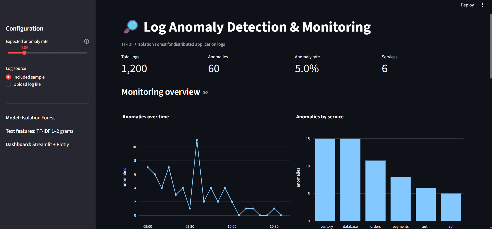
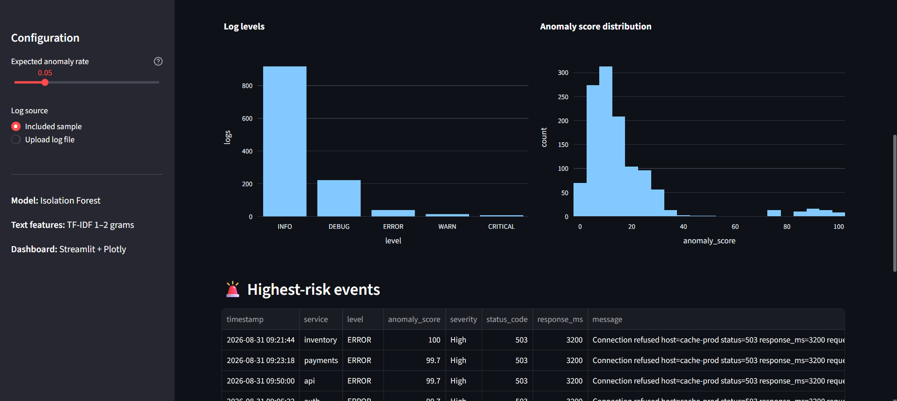
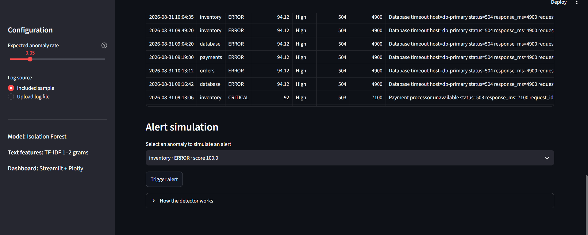

# Log Anomaly Detection & Monitoring System

A Python-based anomaly detection and monitoring system for distributed application logs. The system parses and normalizes noisy log messages, extracts TF-IDF text features and numeric telemetry, and uses an unsupervised Isolation Forest model to identify anomalous events.

## Features

- Regex-based parsing for semi-structured distributed logs
- Normalization of IPs, UUIDs, emails, IDs and other high-cardinality fields
- TF-IDF text features + numeric telemetry (status code, latency, message length, error signals)
- Unsupervised anomaly detection with Isolation Forest
- Interactive Streamlit + Plotly monitoring dashboard
- Anomaly timeline and service-level analysis
- Log-level and anomaly-score distributions
- Risk scoring and severity classification
- Alert simulation for detected anomalies
- Synthetic distributed-log generator with injected incidents
- Unit tests for the parsing pipeline

## Architecture

```text
Raw distributed logs
        |
        v
  Log Parser
        |
        v
  Normalizer
        |
        +----------------------+
        |                      |
        v                      v
   TF-IDF text          Numeric telemetry
        |                      |
        +----------+-----------+
                   v
          Feature Matrix
                   |
                   v
          Isolation Forest
                   |
                   v
       Anomaly score + label
                   |
                   v
      Streamlit Monitoring UI

## Dashboard Preview

The system provides an interactive monitoring dashboard for detecting and analyzing anomalous events across distributed services.

### Monitoring Overview



### Anomaly Analysis



### Alert Simulation


